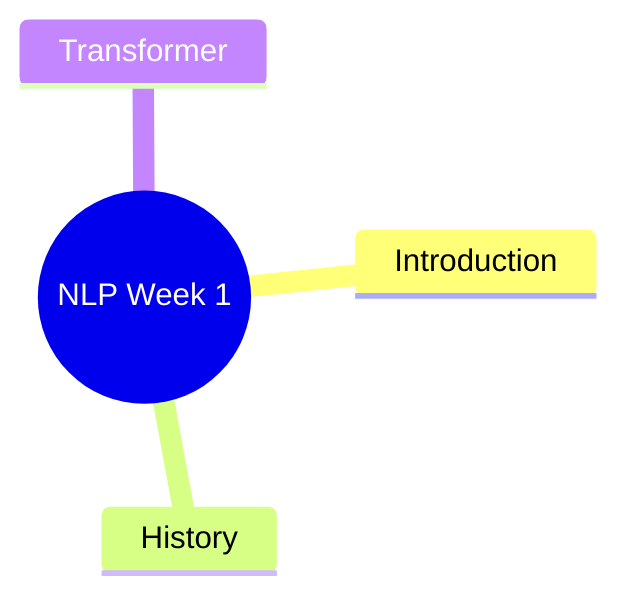

# Importing Notes

This repo now includes a local helper for turning class notes into Hugo posts with a Mermaid mindmap.

## What it does

- Reads `.md`, `.txt`, `.pptx`, and best-effort `.pdf` input
- Creates a Hugo post in `content/post/<slug>/index.md`
- Copies the original file to `static/files/imported/`
- Adds a Mermaid `mindmap` block so the post can show a NotebookLM-style overview

## Quick Start

Run from the project root:

```powershell
python scripts/import_notes.py "C:\Users\Joshua\Downloads\nlp_week_1_introduction_lecture_notes.md" --author JokerFangMax --tag Lecture --tag NLP
```

Then preview:

```powershell
hugo server
```

Open:

```text
http://127.0.0.1:1313/post/
```

## Supported Inputs

- `.md` / `.markdown`
  Best option right now. Existing headings are reused to build the mindmap.
- `.txt`
  Converted into paragraphs and simple headings where possible.
- `.pptx`
  Extracts text from slide XML without extra services.
- `.pdf`
  Uses `pypdf` or `PyPDF2` if available in your Python environment.
  If neither is installed, convert the PDF to Markdown/TXT first or install `pypdf`.

## Useful Options

```powershell
python scripts/import_notes.py <file> --title "NLP Week 1" --slug nlp-week-1 --author JokerFangMax --category Notes --tag NLP --tag Lecture
```

- `--title`: override the generated title
- `--slug`: override the post folder and URL slug
- `--author`: choose the author slug from `content/authors/`
- `--category`: set the post category
- `--tag`: append tags
- `--force`: overwrite an existing generated post directory

## Mermaid In Posts

The generated post includes:

```md
diagram: true
```

and a Mermaid block like:

```md

```

Academic can render that on the page automatically.

## Recommended Workflow

1. Export your notes to Markdown if possible.
2. Run `python scripts/import_notes.py <your-file>`.
3. Review the generated `content/post/<slug>/index.md`.
4. Tweak the wording and the Mermaid tree if you want a cleaner mindmap.
5. Run `hugo server` and preview the result.
