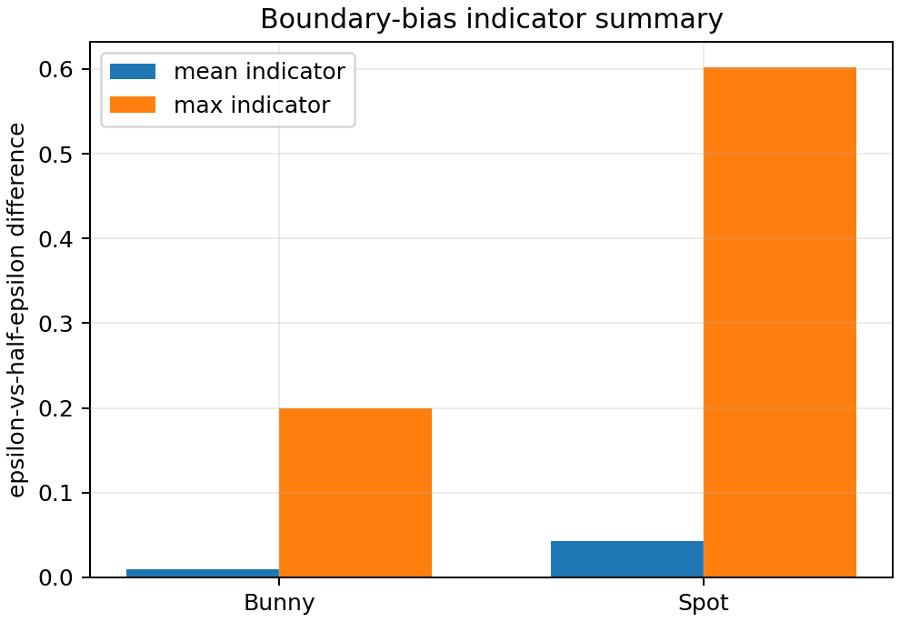
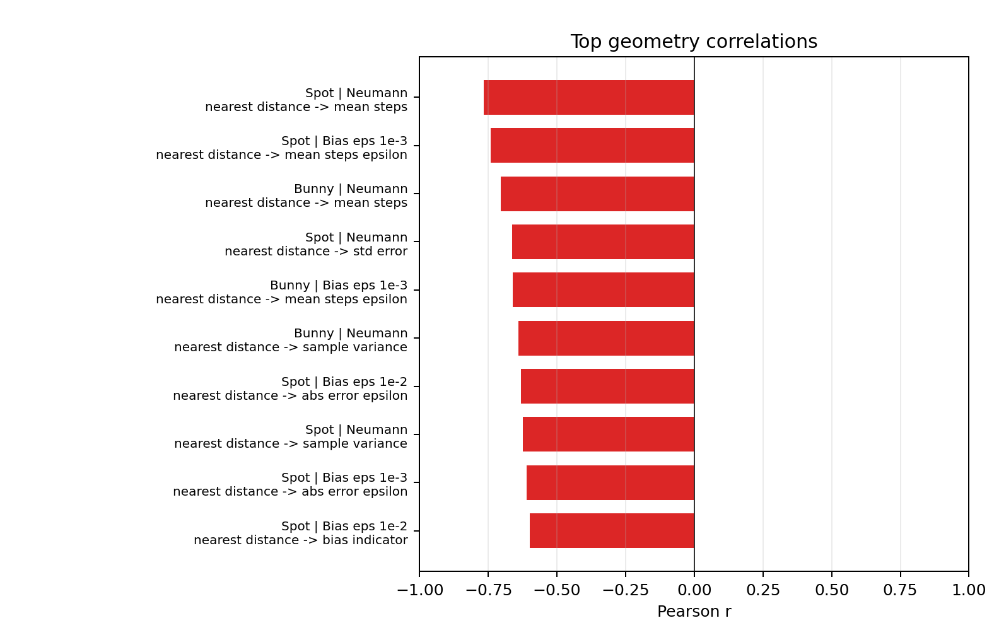
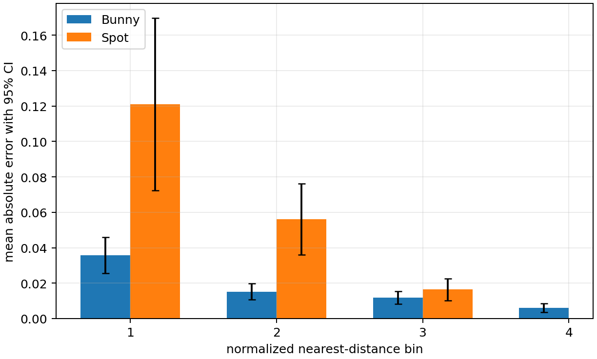
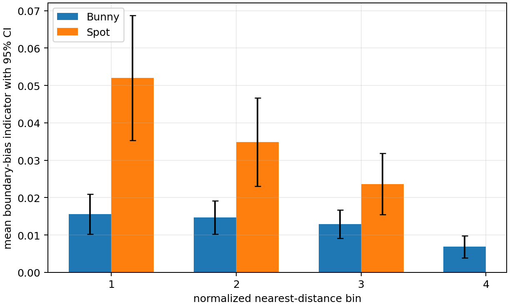
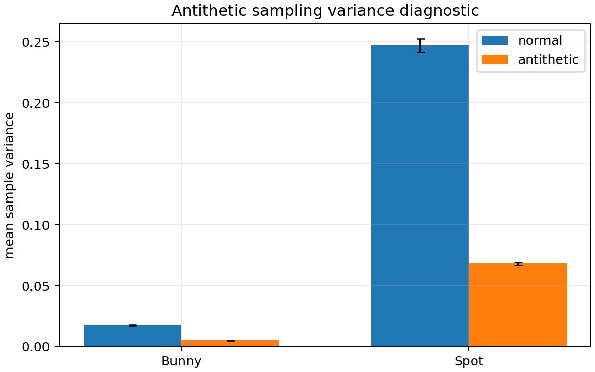
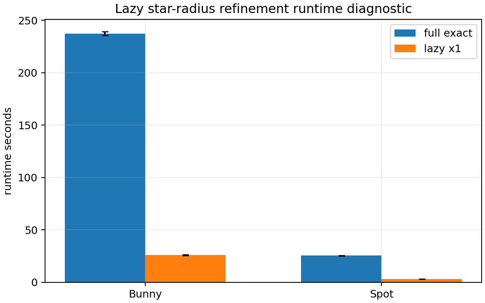
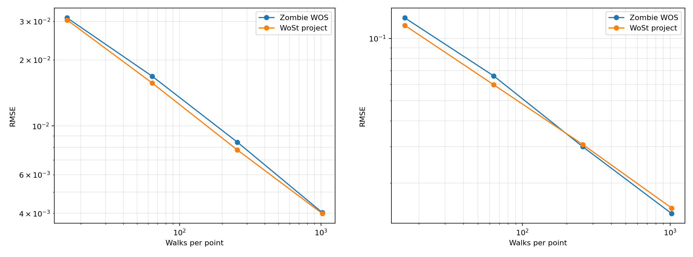
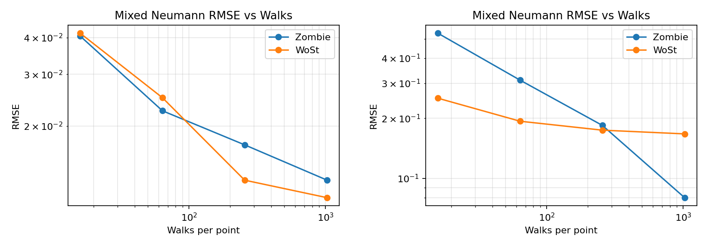
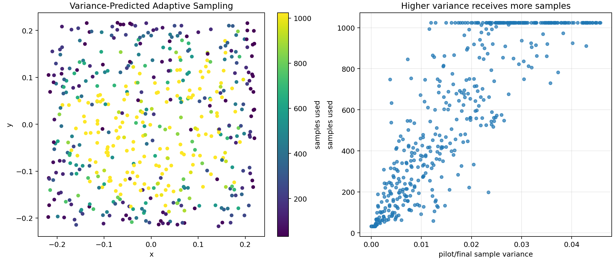
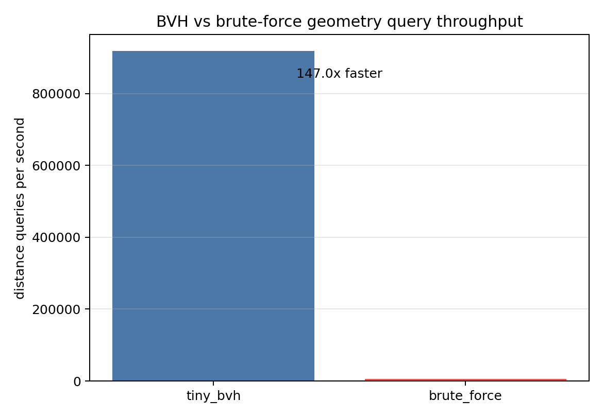

## Overview

This project reproduces and extends **Walk-on-Stars (WoSt)**, a Monte Carlo solver for PDE boundary value problems, and studies how it behaves on 3D mesh domains with **mixed Neumann boundary conditions**.

The main finding is that WoSt behaves predictably in Dirichlet validation, but mixed Neumann conditions expose stronger sensitivity to boundary proximity, epsilon termination, and mesh geometry. Bunny and Spot show noticeably different error patterns, especially near the inner Neumann boundary.

## Highlights

- Reproduced a C++ Walk-on-Stars pipeline for 3D boundary value problems.
- Compared Dirichlet and mixed Neumann behavior on Bunny and Spot meshes.
- Identified boundary proximity as the strongest pointwise diagnostic signal.
- Found that coarse epsilon can dominate mixed Neumann error near the boundary.
- Built interactive 3D viewers for boundary bias and live path tracing.

## Interactive Demos

The interactive viewers are the best entry point for exploring the diagnostic behavior directly.

- **[Launch Boundary Bias Detector 3D](/files/wost-final-project/boundary_bias_detector_3d.html)**: inspect spatial boundary-bias indicators on the mesh.
- **[Launch Live Trace 3D](/files/wost-final-project/live_trace_interactive_3d.html)**: visualize reflection-heavy walk paths near difficult Neumann regions.
- **[Launch Spot Neumann 3D Viewer](/files/wost-final-project/neumann_mixed_grid16_walk128_3d.html)**: explore the Spot mixed Neumann scalar field on a 3D grid.

## Problem Setup

The experiments use a 3D domain formed by an outer cube with an inner triangle mesh removed. The manufactured reference solution is:

$$
u(x, y, z) = x + y + z, \quad \Delta u = 0
$$

For Dirichlet validation, both the outer cube and inner mesh prescribe the boundary value of \(u\). For the mixed Neumann benchmark, the outer cube remains Dirichlet while the inner mesh prescribes normal derivative data. This makes the solver depend more directly on surface normals, reflection behavior, local geometry, and the epsilon boundary tolerance.

## Experiment 1: Dirichlet Validation

**Main claim:** Dirichlet tests show ordinary Monte Carlo convergence and validate the basic pipeline before interpreting the harder mixed Neumann results.

As the number of walks increases, RMSE decreases on both Bunny and Spot. WoSt and the Zombie baseline remain close across tested walk counts, so this stage serves mainly as a sanity check rather than the central scientific result.

Full data: see the [command log](command_log.txt) / [data appendix](data_tables_output.txt).

## Experiment 2: Mixed Neumann Sensitivity

**Main claim:** Mixed Neumann behavior is less uniform than Dirichlet behavior and is much more mesh-sensitive.

Bunny still improves with more walks, but the convergence is less clean than in the Dirichlet case. Spot is substantially harder: high-walk WoSt error remains elevated, suggesting residual systematic effects from reflection, epsilon handling, local geometry, or implementation differences.

Full data: see the [command log](command_log.txt) / [data appendix](data_tables_output.txt).

## Experiment 3: Epsilon and Boundary Bias

**Main claim:** Coarse epsilon can dominate mixed Neumann error, especially near the inner Neumann boundary.

The epsilon sweep shows that large boundary tolerances are risky in the mixed Neumann setting. The epsilon-vs-half-epsilon indicator is not an exact bias decomposition, but it highlights where estimates change strongly as the boundary tolerance is refined.

Full data: see the [command log](command_log.txt) / [data appendix](data_tables_output.txt).

## Experiment 4: Geometry-Sensitive Diagnostics

**Main claim:** The normalized nearest-surface-distance proxy is the strongest observed pointwise predictor of difficult queries.

Near-boundary points account for many high-error, high-variance, and long-path cases. Local normal variation and related mesh descriptors are useful secondary signals, but boundary proximity is the clearest diagnostic trend in this experiment.

Full data: see the [command log](command_log.txt) / [data appendix](data_tables_output.txt).

## Experiment 5: Distance-Controlled Comparison

**Main claim:** Spot remains harder than Bunny after matching by boundary-distance bins, but the gap shrinks with distance.

This reduces the query-distance confounder before comparing meshes. The result suggests that boundary proximity explains a large part of the difficulty, while residual mesh, shape, reflection, or normal effects still matter in close-boundary bins.

Full data: see the [command log](command_log.txt) / [data appendix](data_tables_output.txt).

## Diagnostic Tools

### Adaptive Sampling

**Main claim:** Adaptive sampling is most useful here as a variance diagnostic, not as a guaranteed speedup.

Bunny shows clearer variance-dependent sample allocation. Spot tends to saturate near the maximum sample count, which suggests that high variance is widespread across the sampled domain.

Full data: see the [command log](command_log.txt) / [data appendix](data_tables_output.txt).

### Antithetic Sampling

**Main claim:** Antithetic pairing reduces measured sample variance in diagnostic runs.

This addresses estimator variance, but it does not directly solve epsilon sensitivity or geometry-related systematic error.

Full data: see the [command log](command_log.txt) / [data appendix](data_tables_output.txt).

### Lazy Refinement

**Main claim:** Lazy star-radius refinement substantially reduces runtime while preserving tested mean RMSE in these diagnostic runs.

The result is best read as an engineering optimization diagnostic rather than a general solver-accuracy claim.

Full data: see the [command log](command_log.txt) / [data appendix](data_tables_output.txt).

## Practical Takeaways

- Run Dirichlet sanity checks before interpreting mixed Neumann failures.
- Inspect boundary-distance distributions before comparing meshes.
- Treat near-boundary mixed Neumann queries as high-risk.
- Avoid coarse epsilon near the Neumann boundary.
- Do not assume shorter paths imply lower RMSE.
- Use live traces and boundary-bias views as qualitative diagnostics.

## Extra Figures

These supporting figures are retained for provenance and visual inspection, but the detailed numerical tables are intentionally kept out of the homepage.

*Dirichlet single-mesh panels for Bunny and Spot, showing the convergence trend behind the combined validation figure.*

*Mixed Neumann single-mesh panels, making the cleaner Bunny behavior and harder Spot case easier to compare.*

*Full geometry-correlation diagnostic retained for detailed feature labels and provenance.*

*Bunny epsilon-distance heatmap, showing how boundary tolerance interacts with distance from the inner surface.*

*Spot epsilon-distance heatmap, highlighting stronger near-boundary sensitivity at coarse epsilon.*

*Bunny adaptive-sampling map, showing where the variance-based rule allocates more samples.*

*Spot adaptive-sampling map, where many points approach the maximum sample budget.*

*A 2D slice of a live walk trace, useful as a qualitative view of reflection-heavy behavior.*

*Supporting geometry-query benchmark for BVH acceleration; included as engineering context rather than a solver-accuracy result.*

## Full Materials

The homepage keeps the main story compact. Complete experiment commands, raw outputs, convergence sweeps, epsilon sweeps, diagnostic runs, and generated tables are preserved in the project materials:

- **[View Full Command Log](command_log.txt)**
- **[View Data Appendix](data_tables_output.txt)**
- Generated table scripts in `scripts/`
- Interactive demos in `/files/wost-final-project/`
